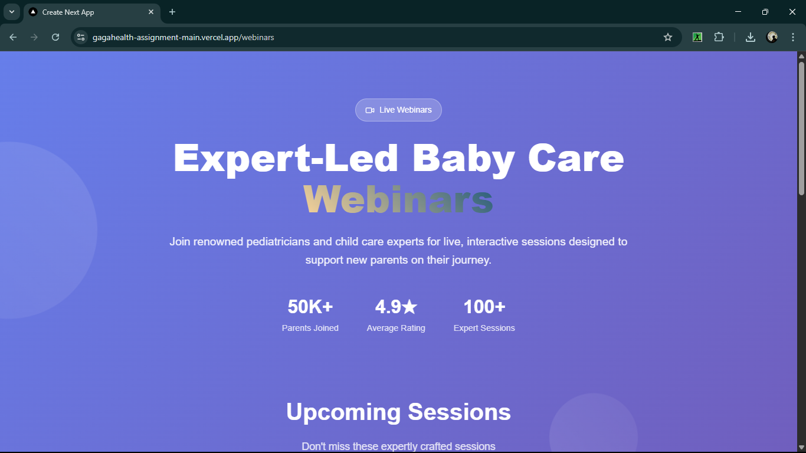
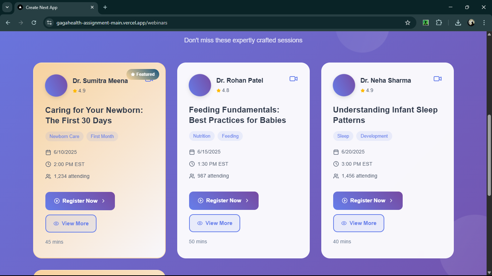
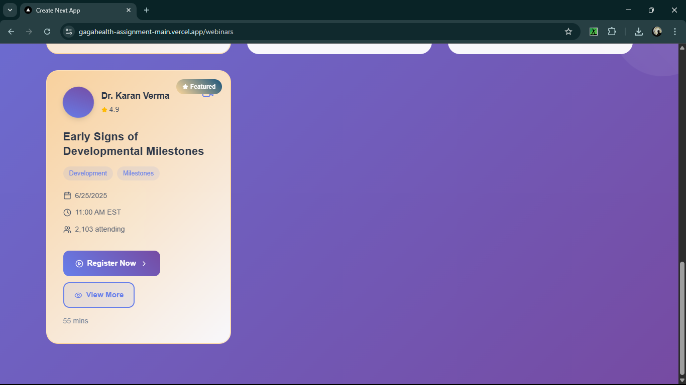

# Gagahealth Assignment

## Live URL

You can view the live Vercel deployment here:  
**[Live Site]([https://gagahealth-assignment-main.vercel.app/webinars)**

---

## Choices Made

I created a separate `WebinarCard` component inside the `/webinars` page because it helps keep the code modular and reusable. This separation made it easier to manage the layout and logic for each webinar, and keeps the main page component clean and readable.

---

## Roadblock & Learning

One small thing I had to look up was the correct way to style buttons in a Next.js (React) + Tailwind project, since I wanted the "View Details" button to look modern and consistent. I checked the Tailwind CSS documentation to ensure I was using the correct class combinations for padding, color, and hover effects.

Another thing I checked was how to properly create a new route using the Next.js app directory structure (creating a `webinars` folder with a `page.tsx` inside), since this was my first time using the app router. The official Next.js docs were helpful for confirming the correct structure.

---

## Screenshot

</img>
</img>
</img>
